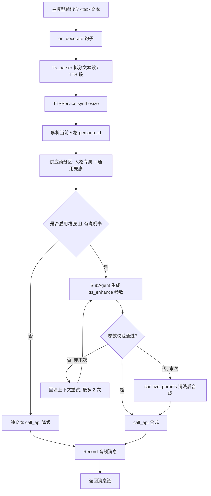

# TTS Enhancer 架构文档

> 本文档面向希望深入理解插件内部机制的开发者与维护者。
> 配套文档：[开发指南](DEVELOPMENT.md) · [英文 README](../en/README.md) · [CHANGELOG](../../CHANGELOG.md)

---

## 1. 设计目标与定位

AstrBot 的主模型（LLM）默认只能向 TTS 环节传递纯文本。然而现代语音合成服务早已支持情感标签、自然语言指令、方言、音色克隆、声音设计等丰富能力。TTS Enhancer 的定位就是**弥合「传统文本输入」与「供应商丰富能力」之间的鸿沟**，并且以**高可插拔**的方式接入任意语音服务，而无需改动核心代码。

核心设计原则：

- **高可插拔的多供应商架构**：每个供应商是一个独立适配器（Adapter），互不干扰，新增供应商即插即用。
- **能力说明书机制（Capability Docs）**：每个供应商配套一份 Markdown 文档，描述其参数与用法；SubAgent 据此动态生成"不越界"的最优参数。
- **按需前端**：仅为缺乏官方 Web 控制台的供应商提供可复用管理组件；已有控制台的供应商直接外链跳转，避免重复实现。
- **防御性边界**：文件 ID、路由参数、上传扩展名、API Key 处理等均有显式安全约束。

---

## 2. 整体架构

插件在 AstrBot 的事件流水线上处于「结果装饰」环节，整体分为四层：

```
┌──────────────────────────────────────────────────────────────────────┐
│  主模型 (LLM)                                                          │
│  - 输出 <tts>…</tts> 标签（或经 Agent Tool 主动调用）                    │
│  - on_llm_req 注入 TTS 触发提示词                                       │
└───────────────────────────────┬──────────────────────────────────────┘
                                 │
┌───────────────────────────────▼──────────────────────────────────────┐
│  TTS Enhancer 插件 (main.py / src/*)                                    │
│  - on_decorate 解析标签 → 拆分文本段与 TTS 段                           │
│  - TTSService 编排合成、上下文、人格路由、多供应商回退                    │
│  - SendVoiceTool 提供 send_voice_to_user 主动语音工具                    │
│  - Web API 路由（音色/文件管理、上传、KV）                               │
└───────────────────────────────┬──────────────────────────────────────┘
                                 │
┌───────────────────────────────▼──────────────────────────────────────┐
│  TTSSubAgent (src/sub_agent.py)                                         │
│  - 调用增强模型 Provider（可选指定 enhance_llm_provider）               │
│  - 注入能力说明书 + 人格 + 上下文 → 通过 tts_enhance 工具产出结构化参数  │
└───────────────────────────────┬──────────────────────────────────────┘
                                 │
┌───────────────────────────────▼──────────────────────────────────────┐
│  Provider Adapter (providers/*)                                         │
│  - 校验/清洗参数 → 调用真实 TTS API → 下载并落盘音频                    │
│  - 可选：音色管理（克隆/设计/列表/删除）、文件管理                      │
│  - 自动发现 + 工厂实例化                                                │
└──────────────────────────────────────────────────────────────────────┘
```

也可以用流程化的视角看一次完整合成：



---

## 3. 请求生命周期（端到端）

存在两条触发路径，最终都汇入 `TTSService.synthesize()`。

### 3.1 标签触发路径（默认）

1. **`on_llm_req`**：若已配置供应商且配置了 `tts_prompt`，将触发提示词追加到系统提示词，引导主模型用 `<tts>…</tts>` 包裹待合成文本。
2. **`on_decorate`**（`priority=13`）：扫描消息链的 `Plain` 文本组件，若包含 `<tts>` 标签，则：
   - 调用 `tts_service.get_context_messages(event)` 取最近 `context_window` 轮上下文；
   - 对含标签的文本调用 `_process_tts_text()`，逐段处理；
   - 用 `split_by_tts_tags()` 把文本切分为 `text` 段与 `tts` 段，文本段保留为 `Plain`，TTS 段交给 `synthesize()`；
   - 合成成功返回 `Record` 组件（可选 `dual_output` 同时保留原文），失败降级为 `Plain` 文本。

### 3.2 工具触发路径（Agent Loop）

1. 插件在 `__init__` 通过 `context.add_llm_tools(SendVoiceTool(...))` 注册 `send_voice_to_user` 工具（定义于 `src/tools.py`）。
2. 模型在 Agent 循环中主动调用该工具，传入 `text`（与可选 `session`）。
3. 工具内部获取上下文、调用 `tts_service.synthesize()`，再用 `star_context.send_message()` 将音频消息发往目标会话。

两条路径共享同一个 `TTSService` 实例（在 `main.py` 构造，注入 `context / providers / config / audio_data_dir`）。

---

## 4. 核心模块分解

### 4.1 `main.py` — 插件入口

职责：初始化、事件钩子、Web API 路由、安全校验。

- **`TTSEnhancerPlugin(Star)`**：生命周期入口。初始化数据目录（`plugin_data/<name>/{uploads,audio}`）、构造 `TTSService`、注册 `SendVoiceTool`、注册全部 Web 路由。
- **事件钩子**：
  - `on_llm_req`：注入 TTS 提示词。
  - `on_decorate`：解析并替换 `<tts>` 标签。
- **Web API**（全部挂在 `/<plugin_name>/` 前缀下，见第 10 节安全设计）：
  - `GET /providers`：按 `template_key` 分组返回供应商列表，`api_key` 脱敏。
  - `POST /voice/{create,list,delete}`：音色管理，按 `entry_id` 路由到适配器。
  - `POST /upload`：本地上传音频（扩展名白名单）。
  - `POST /voice/preview`：音色预览（Base64 返回）。
  - `POST /kv/{set,get,delete}`：通用 KV 存储（前端/适配器存取元数据）。
  - `POST /file/{upload,list,get,delete}`：供应商文件管理（透传 `**kwargs`）。
- **安全辅助**：`_SAFE_FILE_ID_RE`、`_validate_file_id()`、`_resolve_uploads_path()`（resolve 后父目录比较防穿越）、`_parse_entry_id()`（类型与越界校验，排除 `bool`）。

### 4.2 `src/config.py` — 配置管理

`TTSEnhancerConfig` 负责加载与规整配置：

- `_load_providers()`：按 `priority` 稳定排序（值越小越优先）；检测 `priority` 重复与 `display_name` 重名（重名自动追加 `#2`、`#3` 后缀并写入私有字段 `__resolved_name`）。
- `get_providers()`：返回排序后的供应商列表。
- `get_entry_name(entry, index)`：显示名称解析（优先级：`__resolved_name` → `display_name` → `template_key (voice)` → `template_key #index` → `template_key`）。
- `get(key, default)`：读取顶层配置项；`has_providers()`：是否有供应商。
- `_to_priority_int()`：非数值 `priority` 兜底为 `100` 并告警，避免排序时 `int/str` 混排抛 `TypeError`。

### 4.3 `src/tts_parser.py` — 标签解析

`split_by_tts_tags(text)` 将含 `<tts>…</tts>` 的文本切分为 `{type: 'text'|'tts', content}` 列表：

- 非字符串入参直接返回空列表（按"无内容"处理，而非抛异常）。
- 处理孤立结束标签、嵌套/缺失配对等情况；标签内容去首尾边界分隔符与空白。
- 完全无有效片段时，移除标签后作为纯文本兜底。
- 边界分隔符常量：`BOUNDARY_SEPARATORS = "$"`（用于清理标签边界残留）。

### 4.4 `src/tts_service.py` — 合成编排

`TTSService` 是合成流程的"总指挥"：

- `get_context_messages(event)`：从 `conversation_manager` 取最近 `context_window` 条 **user** 消息为窗口（按 user 计数），逆序收集后恢复时间顺序；任何异常降级为空列表。
- `get_current_persona(event)`：解析当前会话生效的人格，返回 `(prompt, persona_id)`；`conversation_manager` / `persona_manager` 未就绪时降级为空。
- `synthesize(raw_text, event, context_messages)`（核心）：
  1. 解析人格 → 将供应商分区为 **人格专属**（`persona_id` 匹配）与 **通用兜底**（无 `persona_id`），有序尝试（专属优先）。
  2. 候选为空时仅 Warning，不静默失败。
  3. 对每个条目：注入 `_data_dir` → `ProviderFactory.get_adapter()` → 判定 `enable_enhance = config.enable_enhance and bool(docs_content)`。
  4. **无增强/无文档**：直接以 `raw_params={}` 纯文本合成（避免白调用一次 LLM）。
  5. **增强路径**：用 `adapter.get_tool_schema()` 构造 `ToolSet` → 调用 `sub_agent.call()`，最多 `max_attempts=2` 次：
     - 返回结构经 `adapter.validate_params()` 校验；末次失败则 `sanitize_params()` 清洗后合成；
     - 非末次失败将"尝试调用/参数错误"回填上下文再试；
     - 异常同样触发重试。
  6. SubAgent 返回空 `text` 时保留原文；最终 `call_api()` 成功返回 `Record.fromFileSystem(path, text=...)`，失败切换下一供应商。

### 4.5 `src/sub_agent.py` — SubAgent

`TTSSubAgent.call(...)` 调用 LLM 生成结构化 TTS 参数：

- 解析增强模型：`enhance_llm_provider` 指定则按 ID 取，否则用当前会话 Provider；未取到则报错返回 `None`。
- 拼装用户提示：人格 + 上下文摘要 + 待合成文本。
- 调用 `provider.text_chat(..., func_tool=tool_set)`；优先解析 `tools_call_name == 'tts_enhance'` 的 `tools_call_args`；
- 无工具调用时降级从 `completion_text` 提取（仅含 `text`）；最终失败返回 `None`。
- 所有异常被捕获并记录，绝不向上抛。

### 4.6 `src/tools.py` — 主动语音工具

`SendVoiceTool(FunctionTool)` 暴露 `send_voice_to_user`：

- 参数：`text`（必填）、`session`（可选，格式 `platform_id:message_type:session_id`）。
- `__post_init__` 校验 `tts_service` 非空；`call()` 内获取上下文、`synthesize()`、用 `star_context.send_message()` 发送。

### 4.7 `providers/` — 适配器体系

见第 5 节。

---

## 5. 供应商适配器体系

### 5.1 抽象基类接口契约（`providers/base.py`）

`TTSProviderAdapter(ABC)` 定义了所有适配器必须/可选实现的接口：

**抽象方法（必须实现）：**

| 方法 | 说明 |
|------|------|
| `get_subagent_system_prompt() -> str` | 生成注入 SubAgent 的系统提示（通常拼接能力说明书）。 |
| `get_tool_schema() -> FunctionTool \| None` | 返回 `tts_enhance` 工具的参数 Schema；不支持 Function Calling 可返回 `None`。 |
| `call_api(text, raw_params, config, voice_id=None) -> str` | 合成并返回音频文件路径（或空串表示失败）。`voice_id` 用于预览时显式覆盖音色。 |

**可选能力（默认 `raise NotImplementedError`）：**

- 音色管理：`create_voice(params)`、`list_voice(**kwargs)`、`delete_voice(**kwargs)`。
- 文件管理：`upload_file(...)`、`list_files(**kwargs)`、`get_file_content(file_id)`、`delete_file(file_id, **kwargs)`。

**通用工具（基类已实现，可直接用）：**

- 类型安全转换：`_as_float(value)`、`_as_int(value)`（兼容 LLM 以字符串返回的数字，排除 `bool`）。
- 校验：`validate_voice_id(...)`（长度 8–256、首字母、字符集、末位约束）、`_count_text_chars(text)`（CJK/全角/emoji 按 2 计）、`validate_text_length(...)`（基于上述计数）。
- 参数处理：`validate_params(params) -> (bool, str)`、`sanitize_params(params) -> dict`（子类覆盖以实现具体范围/枚举校验）。

**文档与元数据：**

- `DOCS_KEY`（类属性，可选）：显式指定复用哪份能力文档；缺省回退到 `template_key`。
- `docs_key` 属性、`_load_docs()`：从 `providers/docs/<docs_key>.md` 读取说明书。
- `get_docs_for_voice(voice)`：可按音色 ID 动态选择文档（如设计音色用 `*_design.md`）。

### 5.2 自动发现与工厂（`providers/__init__.py`）

`ProviderFactory` 实现"零配置"插件化：

- `_discover_adapters()`：扫描 `providers/*.py`，**跳过以下划线开头与 `base.py`**；动态 `importlib` 导入；收集 `issubclass(obj, TTSProviderAdapter)` 且 `obj.__module__ == module.__name__` 的具体类（后者防止基类经多继承被误注册到错误模块名下）。
- `get_adapter(entry)`：`entry["__template_key"]` 即模块文件名（去掉 `.py`），作为映射 key；结果按类缓存。

> `__template_key` 由 AstrBot 框架在 `template_list` 配置中自动注入；文件名与 schema 的 `templates` key 必须一致。

### 5.3 公共基类 `BailianSpeechSynthesizerAdapter`

百炼系适配器共享的基底（`providers/_bailian_speech_synthesizer.py`，以下划线前缀避免被自动发现）：

- 封装阿里云百炼 SpeechSynthesizer 端点、Bearer 认证、请求/响应处理、音频下载。
- 由 `MODEL_NAME`（如 `qwen-audio-3.0-tts`、`cosyvoice-v3.5`）、`VALID_LANGS` 驱动，子类只需声明这两者与少量差异即可接入。
- 实现 `get_tool_schema()`（`tts_enhance`：text/instruction/volume/rate/pitch/language_hints）、`get_subagent_system_prompt()`、`call_api()`、`validate_params/sanitize_params`、`create_voice`（克隆/设计分支）、`list_voice`、`delete_voice`。
- `_extract_model_from_voice_id()`：从复刻音色 ID 解析 `flash/plus`，解决 model 版本自动匹配。
- 初始化时对 `entry` 中的 `api_key` 脱敏以避免写入 debug 日志，并检查 `model` 与音色 ID 解析值是否冲突。

具体百炼适配器（如 `bailian_qwen_audio_3_0_tts.py`）往往只有数行，仅声明 `MODEL_NAME` 等差异。

### 5.4 能力说明书机制

"能力说明书"是 SubAgent 智能生成参数的依据，存放在 `providers/docs/<docs_key>.md`：

- 内容需覆盖：核心参数表（类型/范围/默认值）、情感标签/方言/语言枚举、使用示例。
- **关键段落 `## 你的任务`**：告诉 SubAgent 如何根据上下文选择参数、如何调用 `tts_enhance`。
- 设计音色（不支持方言）单独用 `<docs_key>_design.md`，由 `get_docs_for_voice()` 按音色 ID 自动切换。
- 相同模型的供应商可通过子类 `DOCS_KEY` 复用同一份文档（如百炼版 MiniMax 复用官方 MiniMax 文档），避免冗余拷贝。

---

## 6. 多供应商回退与人格路由

`TTSService.synthesize()` 的供应商选择策略：

1. **人格分区**：根据当前 `persona_id`，将供应商分为 `bound`（绑定该人格）与 `unbound`（未绑定），有序尝试 `bound` 在前。
2. **回退语义**：`bound` 全部失败且存在 `unbound` 时，Warning 后回退通用音色；无任何可用音色或专属失败且无兜底时，Warning 提示并放弃本次合成（返回 `None`）。
3. **单供应商内部重试**：SubAgent 参数非法时，回填上下文重试，最多 2 次；`call_api` 异常或返回空同样切换下一供应商。
4. **纯文本降级**：未启用增强或缺失说明书的供应商，直接以纯文本合成，跳过 SubAgent。

---

## 7. SubAgent 增强机制

增强流程的稳健性设计：

- **结构化产出**：通过 `tts_enhance` Function Calling 让模型输出参数对象（text/instruction/volume/rate/pitch/language_hints 等），而非自由文本。
- **两段式校验**：先 `validate_params`（范围/枚举）→ 末次失败 `sanitize_params`（丢弃非法值，保留合法值）。
- **上下文感知**：将最近对话、`persona` 提示注入 SubAgent，使情感/语速/语种判断贴合语境。
- **降级链**：工具调用失败 → 文本解析降级 → 返回 `None` → 主流程切换供应商或纯文本。
- **无文档即纯文本**：保证"缺少说明书的供应商"不会白跑一次 LLM。
- 调试开关：`log_enhanced_params` 在 INFO 级打印 SubAgent 生成的参数。

---

## 8. 前端架构（`pages/tts_manager/`）

前端是**无需构建**的 Vue 3 应用：

- `index.html` 通过 `<script>` 引入本地 `static/vue.global.prod.js`（UMD，离线可用，无 CDN 依赖），`app.js` 以 `type="module"` 加载。
- `app.js`：
  - `bridge = window.AstrBotPluginPage`，所有后端调用走 `bridge`（含 `bridge.ready()`、`bridge.apiGet('providers')`、`bridge.upload`），绕开 Pages 的 `asset_token` 鉴权与跨域。
  - `componentMap`：把 `template_key` 映射到对应 Vue 组件；`getDisplayName()` 提供中文标签。
  - 按 `template_key` 分组渲染 Tabs，当前组件通过 `<component :is>` 动态装载，并传入 `entries / bridge / template-key`。
- **组件组织**：
  - `components/common/`：跨供应商共享组件（`bailian_speech_synthesizer.js` 复刻/设计两模式（复刻音频经浏览器编码为 Data URL 提交）、`voice_preview_modal.js` 预览模态框、`delete_confirm_modal.js` 删除确认）。
  - `components/*.js`：各供应商薄封装，引用 common 组件并通过 `providerConfig` 配置差异（语言列表、帮助链接、是否支持系统音色等）。
  - `composables/`：`useAudioManager`（全局音频单例/音量）、`useTextValidator`（汉字=2 字符计数与校验）、`useClipboard`、`useToast`。
- 样式集中在 `style.css`；`eslint.config.mjs` 提供可选 lint（仅开发期）。

> 设计取舍：仅补齐"只有 API、没有 UI"的供应商管理体验；已有官方控制台者直接外链，不重复实现。

---

## 9. 配置系统（`_conf_schema.json`）

顶层配置项：

| 配置项 | 类型 | 默认 | 说明 |
|--------|------|------|------|
| `enable_enhance` | bool | true | 启用 SubAgent 参数增强 |
| `enhance_llm_provider` | string（`select_provider`） | "" | 增强模型；留空用当前会话模型 |
| `context_window` | int | 10 | SubAgent 上下文窗口（按 user 消息数） |
| `dual_output` | bool | false | 同时输出文本与语音 |
| `tts_prompt` | text | 触发提示词 | 注入主模型的 TTS 触发说明 |
| `log_enhanced_params` | bool | false | 打印增强参数 |
| `providers` | `template_list` | — | 供应商列表（支持多条目回退） |

`providers` 是 `template_list`：每个模板含 `name`/`hint`/`display_item`/`items`。`items` 中支持 `_special`（`select_provider`/`select_persona`）、`secret: true`（密码框遮罩）、`options`、`condition`（按其他字段值条件显示，如 MiMo 按 `model` 切换音色/设计/复刻字段）。框架会为每个条目注入 `__template_key`。

---

## 10. 安全设计

- **文件 ID 白名单**：`_SAFE_FILE_ID_RE = ^[A-Za-z0-9_][A-Za-z0-9_.\-]{0,127}$`，首字符限定排除 `.`/`..`/`.env` 等；点号虽放行（因真实文件名如 `upload_<ts>.mp3`），但 `/`、`\` 始终被排除。
- **路径穿越二次防护**：`_resolve_uploads_path()` 在 `Path.resolve()` 后比较父目录，确保解析结果不逃逸 `uploads`。
- **路由参数校验**：`_parse_entry_id()` 校验类型（排除 `bool`）与越界，非法返回 `None` → 404。
- **上传扩展名白名单**：`upload_file` 仅允许 `wav/mp3/m4a/aac/ogg/flac`，异常后缀不入盘。
- **API Key 脱敏**：`/providers` 与适配器初始化均对 `api_key` 做 `***** + 末 5 位` 处理，避免写日志泄露。
- **音频提交方式**：音色复刻音频由管理页在浏览器内编码为 Data URL（Base64）直接提交至创建接口，不暴露公网地址或内部监听端口。

---

## 11. 数据目录与持久化

插件数据根：`get_astrbot_data_path() / "plugin_data" / <plugin_name>`，下设：

- `uploads/`：用户上传的参考/复刻音频（`upload_<毫秒时间戳>.<ext>`）。
- `audio/`：合成产物（`tts_<时间戳>.<fmt>`），经 `_data_dir` 注入适配器。
- `cache/mimo_voiceclone/`：MiMo 音频复刻样本 Base64 预编码缓存（键含 mtime/size，变更自动失效）。

KV 存储（`/kv/*`）由 AstrBot 框架提供，用于前端/适配器保存元数据（如 MiniMax 未激活音色列表 `bailian_minimax_unactivated_list`、复刻 `prompt_text` 等）。

> **持久化原则**：所有插件运行数据写到 `plugin_data/` 下，不写入插件自身目录（避免更新/重装丢失）。
</content>
</invoke>
